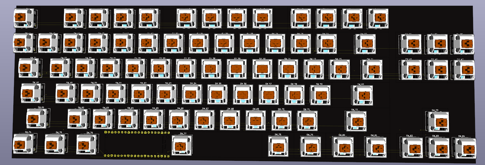

Total Time Spent: 14h

# 18.06
I started working on the schematic, which I got done quickly but I needed to research how keyboard matrices work and found [this](https://www.youtube.com/watch?v=7LyziNdFlew) video by Joe Scotto.

After 3h of brainstorming and designing the schematic, I moved on to the pcb.
This is what took me the longest because I tried to route it manually.

Time spent: 6h

# 19.06
Today I remembered that I have Freerouting installed, so I used it for it's autorouting feature and it saved me many hours of painfully placing vias and routes.
I also adjusted the layout and mcu position.

Time spent: 2h

# 22.06
I placed the mcu under the space key, so that the pcb doesn't look so weird.
I'll need a longer usb cable now 🥲

Time spent: 1h

# 23.06
Today I worked on polishing the repo and uploading all files I used for creating the project.
Tomorrow I will work on the cad model

Time spent: 3h

# 24.07
I finished the model after 1 month because I didn't have enough motivation to finish it.
Also I didn't make a front plate because I like to look at the pcb

I also modified the pcb to not have that cut out in the top right corner

I finally finished the bom and I only need to make the firmware

Time spent: 4h