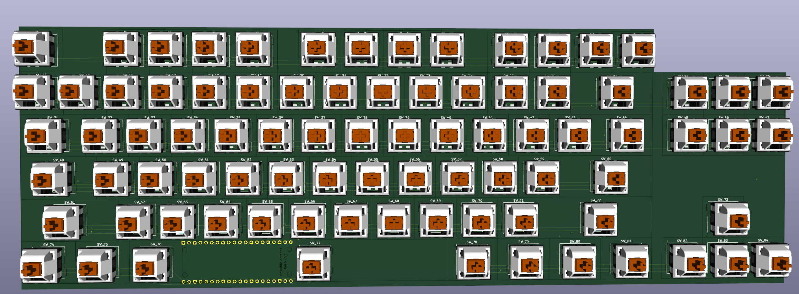

# Lucenox

**Lucenox** — *Light in the Darkness*

---

## Overview

Lucenox is a custom mechanical keyboard built for clean looks, smooth typing, and top-tier build quality. Inspired by light and shadow, it features a sleek design focused on performance.

---

## Reason

I made the project just for fun and to see if I could build my own keyboard.
I wanted something that felt exactly like how I type on my current keyboard, but in a smaller size.

---

## Technical Details

- **Microcontroller:** Raspberry Pi Pico 
- **Firmware:** QMK
- **Connectivity:** USB wired connection
- **LEDs:** SK6812 RGB underglow LEDs with individual addressability

---

## Front

## Back

## Schematic

## Case

## BOM
Quantity  | Name                   | Link                                                                                                     | Price + Shipping
--------- | ---------------------- | -------------------------------------------------------------------------------------------------------- | ----------------
3*30 (90) | Cherry MX Switch       | https://aliexpress.com/item/1005006578935785.html                                                        | 25.17€
84 (90)   | Kailh Hotswap Sockets  | https://candykeys.com/product/kailh-hot-swap-pcb-socket-black                                            | 16.00€
84 (85)   | SK6812MINI LED         | https://lcsc.com/product-detail/RGB-LEDs-Built-in-IC_OPSCO-Optoelectronics-SK6812MINI-E_C5149201.html    | 4.38€
84 (100)  | 0805 Diode (D)         | https://lcsc.com/product-detail/Switching-Diodes_LIZ-Elec-CD4148WSP_C109001.html                         | 1.06€
1         | LCSC Fees              | -                                                                                                        | 9.58€
1         | Raspberry Pi Pico      | https://aliexpress.com/item/1005007384675543.html                                                        | 2.79€
1         | Keycaps                | https://aliexpress.com/item/1005006484466863.html                                                        | 20.99€
1         | PCB (without coupon)   | -                                                                                                        | 73.49€
1         | Total                  |                                                                                                          | 153.46€

### Total
EUR     | USD     | Notes
------- | ------- | -----
153.46€ | 180.31$ | without pcb coupon
133.46€ | 156.81$ | with pcb coupon