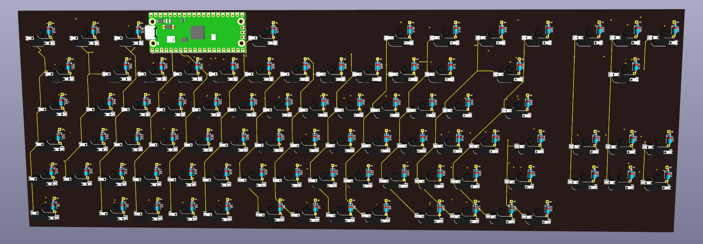
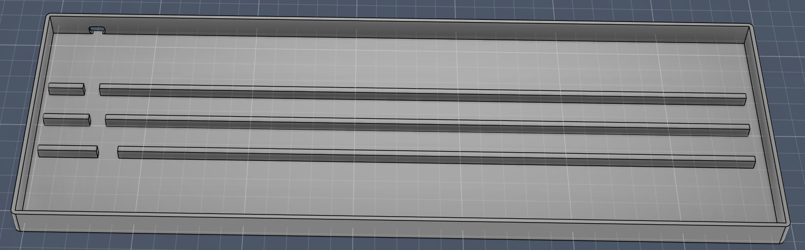

# Lucenox

**Lucenox** — *Light in the Darkness*

---

## Overview

Lucenox is a custom mechanical keyboard with hotswappable switches which was inspired by the QWERTZ layout. It also features per key RGB with QMK!

---

## Reason

I made the project just for fun and to see if I could build my own keyboard, because I wanted something that felt exactly like my current keyboard, but in a smaller size.
Also I currently use a membrane keyboard and I thought that highway could give me an opportunity to learn how mechanical keyboards work and switch to a mechanical one.

---

## Technical Details

- **Microcontroller:** Raspberry Pi Pico 
- **Firmware:** QMK
- **Connectivity:** USB wired connection
- **LEDs:** SK6812 RGB underglow LEDs with individual addressability

---

## Assembly

## Front

## Back

## Schematic

## Case

## BOM
Quantity  | Name                   | Link                                                                                                     | Price + Shipping
--------- | ---------------------- | -------------------------------------------------------------------------------------------------------- | ----------------
3*30 (90) | Cherry MX Switch       | https://aliexpress.com/item/1005006578935785.html                                                        | 25.17€
84 (90)   | Kailh Hotswap Sockets  | https://candykeys.com/product/kailh-hot-swap-pcb-socket-black                                            | 16.00€
84 (85)   | SK6812MINI LED         | https://lcsc.com/product-detail/RGB-LEDs-Built-in-IC_OPSCO-Optoelectronics-SK6812MINI-E_C5149201.html    | 4.38€
84 (100)  | 1N4148 Diode (D)       | https://lcsc.com/product-detail/C84410.html                                                              | 1.28€
1         | LCSC Fees              | -                                                                                                        | 9.58€
1         | Raspberry Pi Pico      | https://aliexpress.com/item/1005007384675543.html                                                        | 2.79€
1         | Keycaps                | https://aliexpress.com/item/1005009489702226.html                                                        | 7.29€
1         | PCB                    | -                                                                                                        | 69.83€
1         | Total                  |                                                                                                          | 136.32€

### Total
EUR     | USD    
------- | -------
136.32€ | 158.82$