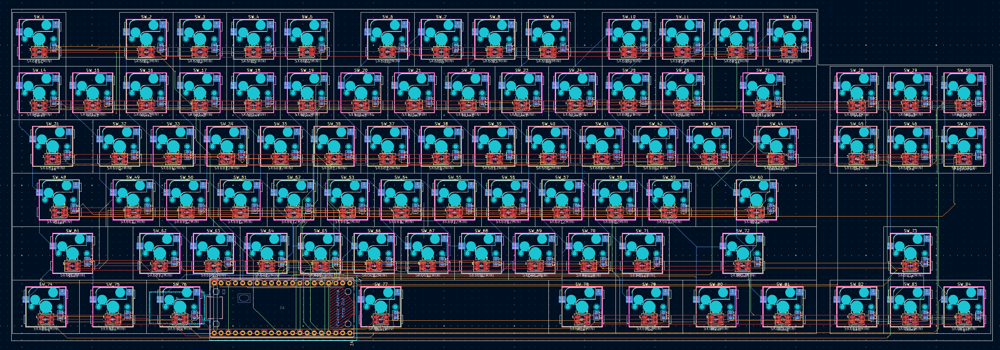

# Lucenox

**Lucenox** — *Light in the Darkness*

---

## Overview

Lucenox is a custom mechanical keyboard built for clean looks, smooth typing, and top-tier build quality. Inspired by light and shadow, it features a sleek design focused on performance.

---

## Reason

I made the project just for fun and to see if I could build my own keyboard.
I wanted something that felt exactly like how I type on my current keyboard, but in a smaller size.

--

## Technical Details

- **Microcontroller:** Raspberry Pi Pico 
- **Firmware:** QMK
- **Connectivity:** USB-C wired connection
- **LEDs:** SK6812 RGB underglow LEDs with individual addressability

---

## Future Plans

- Software for controlling the LEDs

---

## Schematic

## PCB

## BOM
